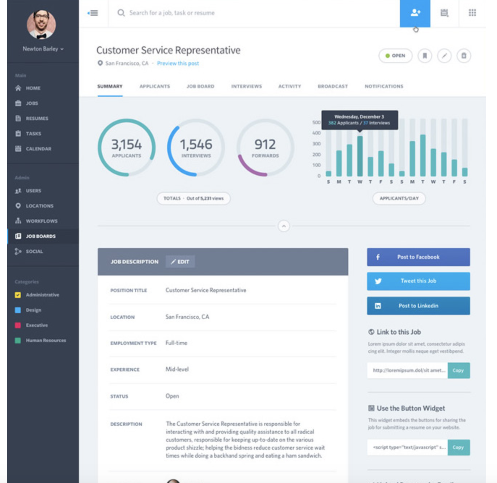
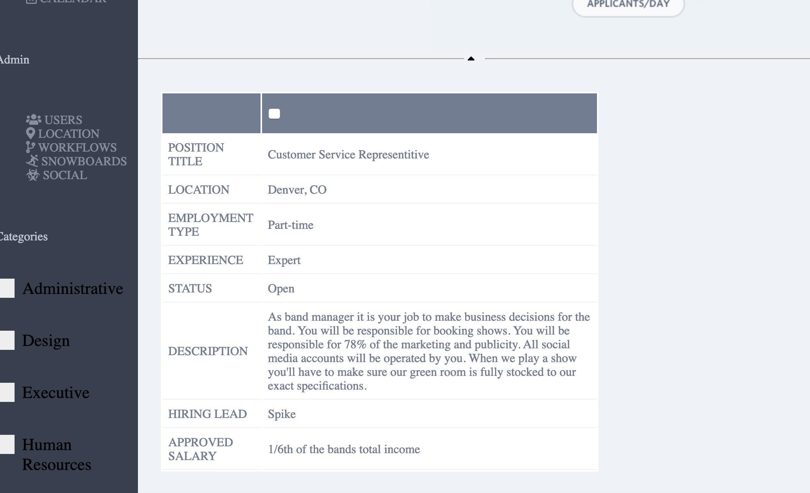
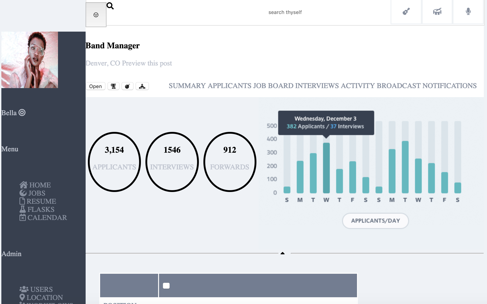

<h1>Static challange 2</h1>
<h3>Ebenezer Jay Ingaslbe</h3>
<h2>Intro</h2>

	For this project I was tasked to recreate a website that was given to us. I was allowed to change images, icons and the color pallete. I was not allowed to change the design layout. 
	

<h2>What I did</h2>

	I used my creative liscense to change some of the icons and content of the site. Some of the original colors and content i kept. I did not make it responsive. Display 'grid' and 'flex' were both used.
	
	

